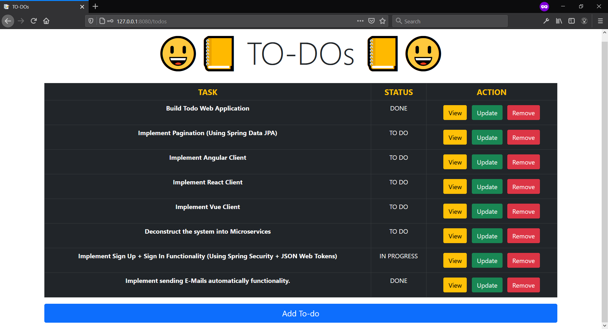
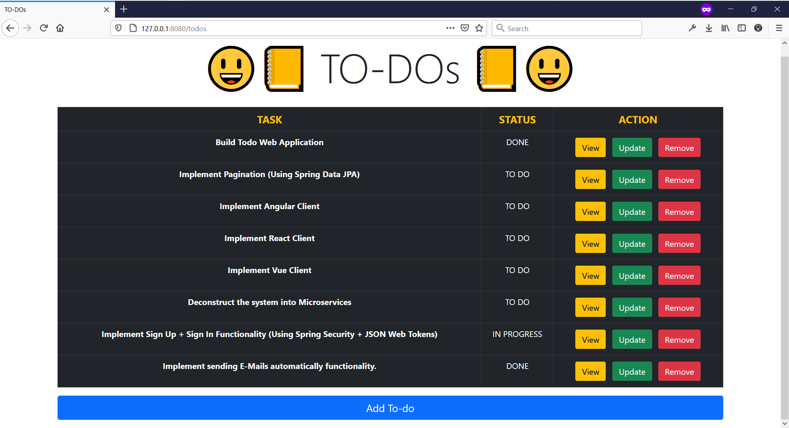
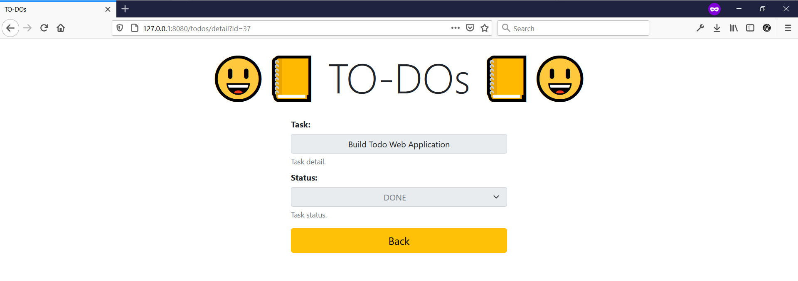
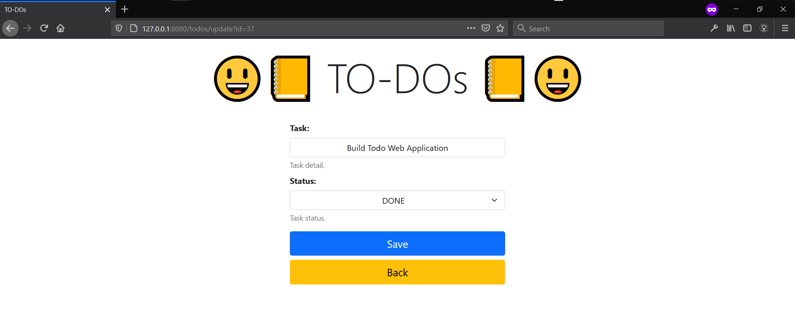
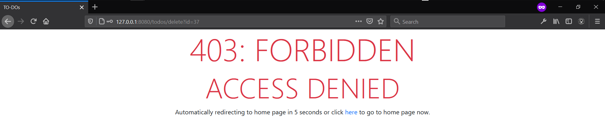

# 😃📒 TO-DOs 📒😃
To-dos Web Application using PostgreSQL, MySQL, Oracle, Microsoft SQL Server, Java, Maven, Spring Framework, Thymeleaf, HTML, CSS, JavaScript.

From the project directory, inside a terminal, run command: `java -jar target/todo-0.0.1-SNAPSHOT.jar` to host locally and run the application on any browser of your choice on [http://127.0.0.1:8080].

